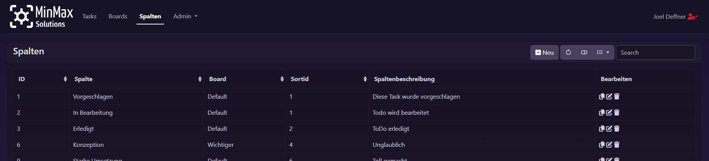

# Kanban Board

This is a project for the course "Webentwicklung" at the University of Trier. The goal of this project is to develop a Kanban Board as a web application. A Kanban Board is a project management tool that helps visualize work, limit work-in-progress, and maximize efficiency.

## Table of Contents
- [Description](#description)
- [Important Note](#important-note)
- [Installation](#installation)
- [Usage](#usage)
- [Screenshots](#screenshots)
  - [Main Task View](#main-task-view)
  - [Task Element](#task-element)
  - [Task CRUD Modal](#task-crud-modal)
  - [Spalten Table View](#spalten-table-view)
  - [Login View](#login-view)
  - [User roles](#user-roles)
- [Project Structure](#project-structure)
- [Contributing](#contributing)
- [License](#license)
- [Contact](#contact)

## Description

This project is a web application developed using the CodeIgniter Framework. It includes a CRUD (Create, Read, Update, Delete) system for managing various types of data, such as Boards, Spalten, Tasks, Personen, and Taskarten. The application uses modals for creating, editing, deleting, and copying data. It also includes forms for each data type and a toast notification system for CRUD operations.

## Important Note

Since this project was developed for a german course, all the terms visible to the user will be in german.
As such this README will use those terms as well. The code itself is mostly written in english and so are the commits.
The following is a brief translation of the most important terms:

- **Spalten**: Columns
- **Personen**: People
- **Taskarten**: Task Types
- **Neu**: New
- **Profil**: Profile
- **Meine Aufgaben**: My Tasks
- **Bearbeiten**: edit
- **Löschen**: delete

## Installation

1. Clone the repository to your local machine.
2. Run `npm install` to install JavaScript dependencies.
3. Initialize the database using the [databaseStructure.sql](databaseStructure.sql) file.
4. Change the [env](env) file name to `.env`.
5. Set up your database and update the `.env` file with your database credentials.
6. Update the `app.baseURL` variable in the `.env` file with the address you will use to access the application in your web browser.
7. Use whatever deployment method you prefer to deploy the application. See the [CodeIgniter documentation](https://codeigniter4.github.io/userguide/) for more information.

#### Scripts

- `npm run scss`: Watches for changes in `main.scss` and compiles it to `main.css`.
- `phpunit`: Runs the PHPUnit tests in the `tests` directory.
## Usage

After the correct deployment, you can access the application in your web browser at the address you specified in the `.env` file.

The application provides a user-friendly interface for managing Tasks inside a Kanban-styled interface. Here's a brief overview of how to use each feature:

- **Tasks**: Tasks are the main entities in this application. You can create a new task by clicking on the "Neu" button in a Spalte. Each task has a name, notes, assignee, and Spalte. You can update these details by clicking on the Task name in the Board view or using the CRUD functions in the dropdown menu located in the top right corner of each Task. The CRUD actions are done inside modals. Tasks can also be dragged and dropped between Spalten to change their status.

- **Boards**: Each Board represents a project or a set of tasks. You can edit or delete a Board by clicking on the corresponding buttons in the Boards view.

- **Spalten**: Each Board can have multiple Spalten. A Spalte represents a stage or a status of Tasks. CRUD operations for Spalten can be performed by clicking on the corresponding buttons in the Board details view.

- **Personen**: Personen are the users or team members in your project. They are assignable to Tasks and can be used to filter Tasks. When logged in, you can see your own tasks by clicking on the "Meine Aufgaben" button in the user dropdown menu in the top right corner of the application. You can create a new person by signing up with a new account. You can also update your details by clicking on the "Profil" button in the user dropdown menu. Personen also have a role, which can be "Administrator" or "Benutzer". Admins can create, update, and delete all data in the application, while Benutzers can only create, update, and delete the non-admin tables.

- **Taskarten**: Taskarten are the categories or types of Tasks in your project. You can add a new task type by clicking on the "Neu" button in the main menu.

## Screenshots

### Main Task View

### Task Element

From left to right, top to bottom the content of the task element is as follows:
Icon of the Taskart, name of the task, button to open the CRUD dropdown seen in the image, creation date,
reminder date, notes and assignee.

### Task CRUD Modal

### Spalten Table View

### Login View

### User roles

Gast is a user that is not logged in.

Benutzer is a user that is logged in.

Admin is a user that is logged in and has admin rights.

## Project Structure

Since our project is based on the CodeIgniter framework, please refer to the [CodeIgniter application structure documentation](https://codeigniter4.github.io/userguide/concepts/structure.html) for more information about the general project structure.

### Project Structure Overview

`root`: Project root directory 
&nbsp;├── `.env`: Environment variables 
&nbsp;├── `databaseStructure.sql`: SQL script for setting up the database 
&nbsp;├── `package.json`: Defines npm package dependencies for the project 
&nbsp;├── `app`: Main application directory 
&nbsp;│&nbsp;&nbsp;&nbsp;&nbsp;&nbsp;&nbsp;&nbsp;&nbsp;├── `Cells`: CodeIgniter Cells for view fragments 
&nbsp;│&nbsp;&nbsp;&nbsp;&nbsp;&nbsp;&nbsp;&nbsp;&nbsp;├── `Config`: Configuration files 
&nbsp;│&nbsp;&nbsp;&nbsp;&nbsp;&nbsp;&nbsp;&nbsp;&nbsp;│&nbsp;&nbsp;&nbsp;&nbsp;&nbsp;&nbsp;&nbsp;&nbsp;&nbsp;&nbsp;├── `Routes.php`: Defines the routes and their filters 
&nbsp;│&nbsp;&nbsp;&nbsp;&nbsp;&nbsp;&nbsp;&nbsp;&nbsp;│&nbsp;&nbsp;&nbsp;&nbsp;&nbsp;&nbsp;&nbsp;&nbsp;&nbsp;&nbsp;├── `Filters.php`: Configures the scope of the filters 
&nbsp;│&nbsp;&nbsp;&nbsp;&nbsp;&nbsp;&nbsp;&nbsp;&nbsp;│&nbsp;&nbsp;&nbsp;&nbsp;&nbsp;&nbsp;&nbsp;&nbsp;&nbsp;&nbsp;└── `Validation.php`: Defines the validation rules used in the Models 
&nbsp;│&nbsp;&nbsp;&nbsp;&nbsp;&nbsp;&nbsp;&nbsp;&nbsp;├── `Controllers`: Connect a route call with the views 
&nbsp;│&nbsp;&nbsp;&nbsp;&nbsp;&nbsp;&nbsp;&nbsp;&nbsp;├── `Filters`: Filters for pre and post processing of HTTP requests 
&nbsp;│&nbsp;&nbsp;&nbsp;&nbsp;&nbsp;&nbsp;&nbsp;&nbsp;├── `Models`: Models for the database tables 
&nbsp;│&nbsp;&nbsp;&nbsp;&nbsp;&nbsp;&nbsp;&nbsp;&nbsp;└── `Views`: Views are the output or what the user sees 
&nbsp;│&nbsp;&nbsp;&nbsp;&nbsp;&nbsp;&nbsp;&nbsp;&nbsp;&nbsp;&nbsp;&nbsp;&nbsp;&nbsp;&nbsp;&nbsp;&nbsp;&nbsp;&nbsp;&nbsp;├── `components`: Reusable components for views 
&nbsp;│&nbsp;&nbsp;&nbsp;&nbsp;&nbsp;&nbsp;&nbsp;&nbsp;&nbsp;&nbsp;&nbsp;&nbsp;&nbsp;&nbsp;&nbsp;&nbsp;&nbsp;&nbsp;&nbsp;├── `layouts`: Layouts for the application 
&nbsp;│&nbsp;&nbsp;&nbsp;&nbsp;&nbsp;&nbsp;&nbsp;&nbsp;&nbsp;&nbsp;&nbsp;&nbsp;&nbsp;&nbsp;&nbsp;&nbsp;&nbsp;&nbsp;&nbsp;├── `pages`: Individual pages 
&nbsp;│&nbsp;&nbsp;&nbsp;&nbsp;&nbsp;&nbsp;&nbsp;&nbsp;&nbsp;&nbsp;&nbsp;&nbsp;&nbsp;&nbsp;&nbsp;&nbsp;&nbsp;&nbsp;&nbsp;└── `templates`: Templates used in the layouts 
&nbsp;├── `public`: Publicly accessible files 
&nbsp;│&nbsp;&nbsp;&nbsp;&nbsp;&nbsp;&nbsp;&nbsp;&nbsp;└── `resources`: Resources like CSS, JavaScript, and images 
&nbsp;│&nbsp;&nbsp;&nbsp;&nbsp;&nbsp;&nbsp;&nbsp;&nbsp;&nbsp;&nbsp;&nbsp;&nbsp;&nbsp;&nbsp;&nbsp;&nbsp;&nbsp;&nbsp;&nbsp;├── `css`: CSS files for styling 
&nbsp;│&nbsp;&nbsp;&nbsp;&nbsp;&nbsp;&nbsp;&nbsp;&nbsp;&nbsp;&nbsp;&nbsp;&nbsp;&nbsp;&nbsp;&nbsp;&nbsp;&nbsp;&nbsp;&nbsp;├── `scss`: SCSS files for styling 
&nbsp;│&nbsp;&nbsp;&nbsp;&nbsp;&nbsp;&nbsp;&nbsp;&nbsp;&nbsp;&nbsp;&nbsp;&nbsp;&nbsp;&nbsp;&nbsp;&nbsp;&nbsp;&nbsp;&nbsp;├── `js`: JavaScript files for interactivity 
&nbsp;│&nbsp;&nbsp;&nbsp;&nbsp;&nbsp;&nbsp;&nbsp;&nbsp;&nbsp;&nbsp;&nbsp;&nbsp;&nbsp;&nbsp;&nbsp;&nbsp;&nbsp;&nbsp;&nbsp;└── `images`: Images used (e.g. logo) 
&nbsp;├── `system`: CodeIgniter system directory 
&nbsp;└── `writable`: CodeIgniter write directory 

## Contributing

Contributions are welcome. Please fork the repository and create a pull request with your changes. 
For major changes, please open an issue first to discuss what you would like to change. 
If you find a bug, please report it using the issue tracker.

## License

This project is licensed under the MIT License. See the [LICENSE](LICENSE) file for more details.

## Contact

You can contact any of the contributors to this project through their respective E-Mail addresses:

@JDeffner: [s4jodeff@uni-trier.de](mailto:s4jodeff@uni-trier.de)

@talina2: someEmail

@4kecast: someEmail